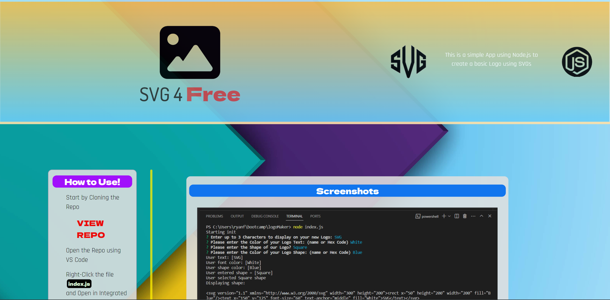

<a id="badges"></a>
[](https://opensource.org/licenses/MIT)


# SVG 4 Free

## Description
A simple node.js app designed to generate a basic logo in SVG file format.


## Table of Contents
1. [Usage](#usage)
2. [Installation Code](#installation)
3. [Contributing](#contributing)
4. [Screenshot](#screenshot)
5. [License](#license)
6. [Tests](#tests)
7. [Links](#links)
8. [Questions](#support)

---

<a id="usage"></a>
## Usage
Download the Clone Repo and Install Dependencies: Node, Inquirer, Graceful-FS, and Jest.  Then run the program by using the following command in the terminal:

<a id="installation"></a>
```
node index.js
```

---

<a id="contributing"></a>
## Contributing
None


<a id="screenshot"></a>
## Screenshot


---


<a id="license"></a>
## License
[MIT](url)


<a id="tests"></a>
## Tests
Jest


<a id="links"></a>

## Links

### Repo Link:
 https://github.com/8BitGinger/logoMaker

### Deployed Link:
https://8bitginger.github.io/logoMaker/

### Video Demo Link:


### Clone Link:
```
git@github.com:8BitGinger/logoMaker.git
```

<a id="support"></a>
## Questions
Reach out for Questions or Support here:
### Email: 
ryan.fann@gmail.com
#### GitHub Username: 
[8BitGinger](https://github.com/8BitGinger)

